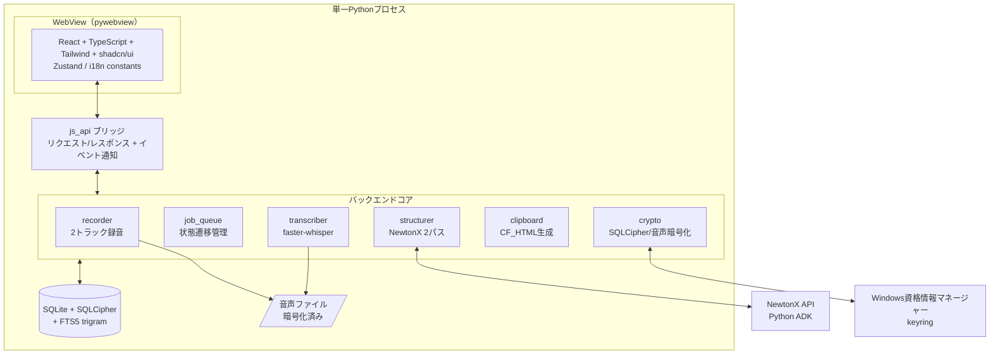
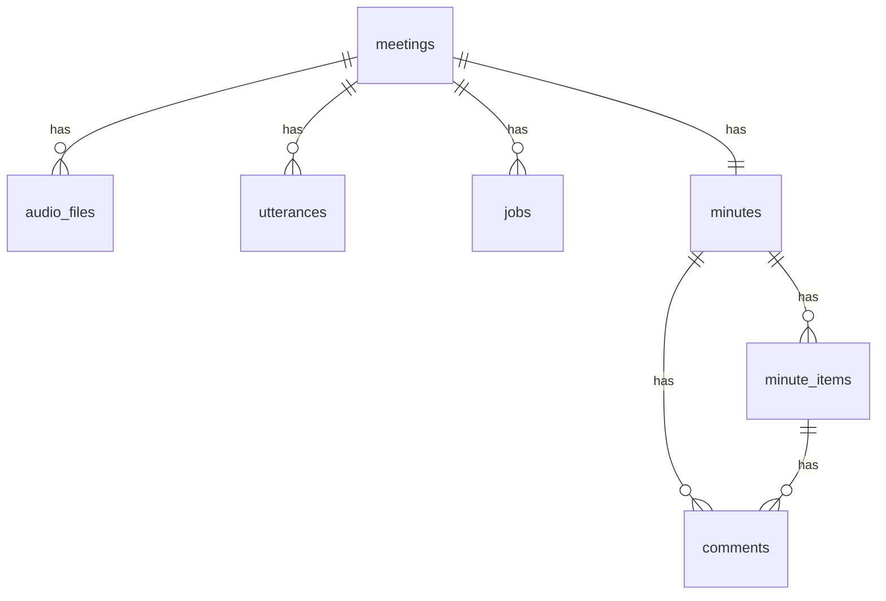
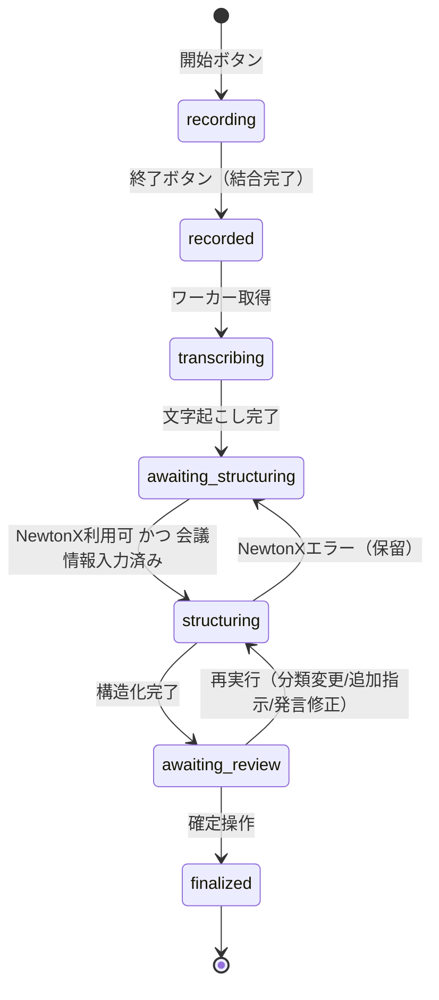
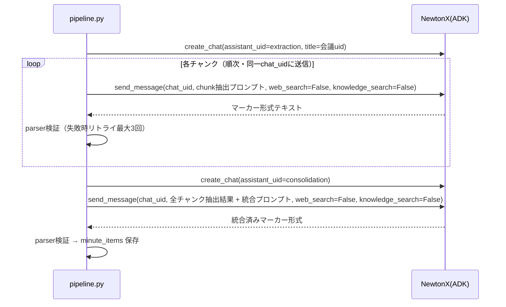
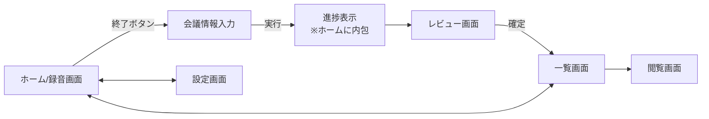

# 議事録自動生成アプリ 設計書

| 項目 | 内容 |
|---|---|
| バージョン | v0.9（要件定義書 v0.9 準拠） |
| 作成日 | 2026-08-15 |
| 対象読者 | 開発者本人 / Claude Code |
| 位置づけ | システム内部構造のドキュメント。課題・背景・目的は要件定義書を参照 |

---

## 1. システム全体構成

### 1.1 プロセス構成

Python + pywebview の単一プロセス構成。UI（React）は pywebview の WebView 上で動作し、`js_api` ブリッジ経由で Python バックエンドと通信する。



### 1.2 スレッドモデル

| スレッド | 役割 | 備考 |
|---|---|---|
| メイン | pywebview / UIイベント | ブロッキング処理禁止 |
| 録音スレッド ×2 | マイク / ループバックの各トラック録音 | 会議ごとに生成。録音中は最優先 |
| ワーカースレッド | ジョブキュー消化（文字起こし・構造化） | **直列実行**。録音中は文字起こしの並列数を抑制 |
| 進捗通知 | ワーカー → UI へのイベントプッシュ | `window.evaluate_js` 経由 |

録音とワーカーの共存ルール：録音スレッドがアクティブな間、Whisper の並列チャンク数を `max(1, cpu_count // 2)` に制限し、会議アプリの音声品質への影響を防ぐ。

---

## 2. ディレクトリ構成

```
minutes-app/
├─ backend/
│  ├─ main.py                    # エントリポイント（pywebview起動）
│  ├─ api/
│  │  └─ bridge.py               # js_api 実装（UIとの唯一の接点）
│  ├─ core/
│  │  ├─ recorder/
│  │  │  ├─ device_manager.py    # デバイス列挙・レベルメーター
│  │  │  ├─ track_recorder.py    # 1トラック録音（60秒ローリング）
│  │  │  └─ session.py           # 2トラック統括・結合・復旧検出
│  │  ├─ transcriber/
│  │  │  ├─ whisper_engine.py    # faster-whisperラッパ・VAD・並列制御
│  │  │  ├─ merger.py            # 2トラック時系列マージ・話者ラベル
│  │  │  └─ dictionary.py        # 固有名詞辞書 → initial_prompt生成
│  │  ├─ structurer/
│  │  │  ├─ newtonx_client.py    # ADKラッパ（認証・送信・リトライ）
│  │  │  ├─ chunker.py           # 発言ログのチャンク分割
│  │  │  ├─ prompt_builder.py    # 内蔵プロンプト + オプション + 追加セクション組立
│  │  │  ├─ parser.py            # マーカー形式パーサ + 検証
│  │  │  └─ pipeline.py          # 2パス実行・差分再実行制御
│  │  ├─ queue/
│  │  │  └─ job_queue.py         # ジョブ管理・状態遷移・再開
│  │  ├─ crypto/
│  │  │  ├─ key_manager.py       # keyring鍵管理（生成・取得）
│  │  │  └─ file_crypto.py       # 音声ファイルAES暗号化
│  │  └─ clipboard/
│  │     └─ cf_html.py           # CF_HTML + プレーンテキスト同時格納
│  ├─ db/
│  │  ├─ connection.py           # SQLCipher接続・PRAGMA key
│  │  ├─ migrations/             # スキーママイグレーション（連番SQL）
│  │  └─ repositories/           # テーブル別リポジトリ（DB操作の単一実装箇所）
│  ├─ prompts/                   # システムプロンプト（内蔵・ユーザー編集不可）
│  │  ├─ extraction_consensus.txt
│  │  ├─ extraction_report.txt
│  │  ├─ consolidation.txt
│  │  └─ fragments/              # オプション別プロンプト断片
│  ├─ constants/
│  │  └─ app_constants.py        # パス解決・既定値（Zero Hardcoding）
│  └─ tests/
├─ frontend/
│  ├─ src/
│  │  ├─ pages/                  # 画面単位（§6参照）
│  │  ├─ components/             # 共通コンポーネント
│  │  ├─ stores/                 # Zustand（§6.4参照）
│  │  ├─ locales/ja.json         # 全UI文言（Zero Hardcoding）
│  │  ├─ api/client.ts           # bridge呼び出しの型付きラッパ
│  │  └─ types/                  # 共有型定義
│  └─ ...
├─ models/                       # Whisperモデル格納（配布時同梱・差し替え可）
└─ data/                         # 実行時生成（DB・音声）※実行ファイル基準の相対パス
   ├─ app.db                     # SQLCipher
   └─ audio/{meeting_uid}/
```

パス解決原則：`models/` `data/` は**実行ファイル基準の相対パス**で解決する（`sys.frozen` 判定で開発時と PyInstaller 配布時を吸収）。`app_constants.py` に一元実装。

---

## 3. データベース設計

### 3.1 ER図



### 3.2 テーブル定義

#### meetings（会議）

| 列 | 型 | 制約 | 説明 |
|---|---|---|---|
| id | INTEGER | PK AUTOINCREMENT | |
| uid | TEXT | UNIQUE NOT NULL | UUID。ファイルパス等の外部識別子 |
| name | TEXT | | 会議名（終了後入力。未入力時NULL可） |
| meeting_type | TEXT | | `consensus` / `report`（終了後入力） |
| started_at | TEXT | NOT NULL | ISO8601 |
| ended_at | TEXT | | ISO8601 |
| duration_sec | INTEGER | | 終了時算出 |
| status | TEXT | NOT NULL | §4.1 の状態値 |
| custom_instruction | TEXT | | 追加セクション指示（最終実行時の値） |
| output_options | TEXT | | JSON。セクション含有スイッチ |
| is_deleted | INTEGER | DEFAULT 0 | 論理削除フラグ |
| created_at / updated_at | TEXT | NOT NULL | |

#### audio_files（音声ファイル）

| 列 | 型 | 説明 |
|---|---|---|
| id | INTEGER PK | |
| meeting_id | INTEGER FK | |
| track | TEXT | `mic` / `loopback` |
| stage | TEXT | `raw_wav` / `compressed` |
| path | TEXT | data/audio/ 配下の相対パス |
| encrypted | INTEGER | 常に1（暗号化必須） |
| expires_at | TEXT | 作成日 + 1ヶ月。起動時バッチで物理削除 |
| deleted_at | TEXT | 物理削除実行日時 |

#### utterances（発言ログ）

| 列 | 型 | 説明 |
|---|---|---|
| id | INTEGER PK | |
| meeting_id | INTEGER FK | |
| seq_no | INTEGER | 会議内連番（発言ID。UI表示・根拠参照に使用） |
| speaker | TEXT | `self` / `other` |
| started_ms / ended_ms | INTEGER | 会議開始からの相対ミリ秒 |
| text | TEXT | Whisper出力（原文。不変） |
| revised_text | TEXT | ユーザー修正後（NULL=未修正）。構造化には COALESCE(revised_text, text) を使用 |
| chunk_index | INTEGER | 構造化チャンク番号（差分再実行の単位） |

#### minutes（議事録）

| 列 | 型 | 説明 |
|---|---|---|
| id | INTEGER PK | |
| meeting_id | INTEGER FK UNIQUE | 1会議1議事録 |
| summary | TEXT | 3行サマリ |
| generation_count | INTEGER | 構造化実行回数（差分比較用） |
| finalized_at | TEXT | 確定日時（NULL=未確定） |

#### minute_items（議事録項目）

| 列 | 型 | 説明 |
|---|---|---|
| id | INTEGER PK | |
| minutes_id | INTEGER FK | |
| section | TEXT | `decision` / `pending` / `todo` / `report` / `custom` |
| custom_section_name | TEXT | section=custom 時のセクション名 |
| title | TEXT NOT NULL | |
| content | TEXT NOT NULL | |
| attrs | TEXT | JSON。セクション別属性（§3.3） |
| evidence_utterance_ids | TEXT | JSON配列。根拠発言の seq_no |
| evidence_summary | TEXT | 根拠発言の要約（議事録出力用） |
| confidence | REAL | 0.0〜1.0（内部データ。議事録非出力） |
| review_state | TEXT | `unchecked` / `checked` |
| changed_in_last_run | INTEGER | 差分再実行で変化した項目=1（ハイライト用） |
| sort_order | INTEGER | セクション内表示順 |
| origin | TEXT | `ai` / `user`（ユーザー追加項目の区別） |

#### comments（コメント）

| 列 | 型 | 説明 |
|---|---|---|
| id INTEGER PK / minutes_id FK / minute_item_id FK NULL / body TEXT / created_at TEXT | | minute_item_id が NULL なら議事録全体へのコメント |

#### その他

| テーブル | 主要列 | 説明 |
|---|---|---|
| jobs | meeting_id, type(`transcribe`/`structure`), status, progress, error_message, target_chunks(JSON) | ジョブキュー。target_chunks は差分再実行の対象指定 |
| dictionary | key, value | 固有名詞辞書（誤変換表記 → 正表記） |
| section_templates | name, instruction | 追加セクションテンプレート |
| settings | key, value | UI設定全般（閾値・モデル選択・テーマ・デバイス・出力オプション既定値） |

### 3.3 minute_items.attrs のセクション別スキーマ

```jsonc
// decision（決定事項）
{
  "decision_level": "confirmed" | "interim",   // 確定 / 中間決定
  "needs_followup": true,                       // 中間決定時 true
  "history": "当初A案で合意したが、○○の指摘によりB案に変更"  // 変遷時のみ
}
// pending（未決事項）
{
  "reason": "意見対立" | "情報不足" | "持ち帰り" | "その他",
  "considerations": "検討事項テキスト"
}
// todo
{
  "assignee": { "name": "田中", "side": "other", "identified": true },
  "due": "2026-08-22" | "期限未定"
}
// report（報告事項）
{
  "category": "進捗報告" | "連絡" | "相談",
  "state": "未着手" | "実施中" | "完了" | "保留" | "その他",  // 進捗報告以外は「その他」固定
  "response": "回答内容",
  "note": "備考"
}
```

属性の検証は parser.py にスキーマとして実装し、NewtonX 出力の不正値はリトライ対象とする。

### 3.4 全文検索（FTS5）

```sql
CREATE VIRTUAL TABLE minutes_fts USING fts5(
  meeting_name, summary, item_title, item_content, comment_body,
  content='', tokenize='trigram'
);
```

- 外部コンテンツ方式（contentless）。minutes / minute_items / comments の INSERT・UPDATE・DELETE 時にリポジトリ層から同期する（トリガーではなくリポジトリ実装に集約：DRY原則）。
- 検索結果は meeting_id に解決して一覧画面へ返す。
- 発言ログ（utterances）は対象外。将来追加できるよう、FTS同期処理はテーブル単位に分離しておく。

---

## 4. ジョブキューと状態遷移

### 4.1 会議ステータス



### 4.2 キュー制御ルール

| ルール | 内容 |
|---|---|
| 録音独立 | `recording` はキューと無関係に常に開始可能（連続会議対応） |
| 直列実行 | transcribe / structure ジョブはワーカー1本で直列消化 |
| 優先度 | transcribe を structure より優先（ボトルネック先行） |
| 録音中の抑制 | 録音セッションがアクティブな間、Whisper並列数を半減 |
| 保留と再開 | NewtonXエラー時は `awaiting_structuring` に戻し、jobs.error_message に記録。一覧画面から手動再開 |
| 起動時復旧 | 起動時に (1) 未結合の連番WAV検出 → 復旧提案、(2) `transcribing` / `structuring` で中断したジョブ → 再キュー、(3) 期限超過音声の物理削除 を実行 |

---

## 5. コア機能設計

### 5.1 録音（recorder）

#### デバイス管理

- `pyaudiowpatch` で WASAPI デバイスを列挙。ループバックは `isLoopbackDevice` フラグで抽出。
- 既定値：OS既定の入力デバイス / 既定出力デバイスのループバック。設定画面で上書き可。
- レベルメーター：開始前画面で両トラックの RMS を 100ms 間隔でUIへプッシュ。

#### Phase 0 実装メモ（device_manager.py / track_recorder.py）

- デバイス解決は `PyAudio.get_default_wasapi_device(d_in=True)`（マイク）/
  `PyAudio.get_default_wasapi_loopback()`（ループバック）を使用する。いずれも
  pyaudiowpatch 本体が提供する高レベルAPIで、既定出力デバイスに対応するループバック
  デバイスの探索ロジックを自前実装しない（公式サンプル
  [`pawp_record_wasapi_loopback.py`](https://github.com/s0d3s/PyAudioWPatch/blob/master/examples/pawp_record_wasapi_loopback.py)
  と同じ解決方針）。
- ストリームは `format=paInt16` 固定・`channels`/`rate` はデバイスの
  `maxInputChannels`/`defaultSampleRate`（ネイティブ値）を用いて `stream_callback`
  （非ブロッキング）で開く。WASAPI ループバックはネイティブ以外のサンプルレートでの
  取得を保証しないため、Phase 0 の時点では 16kHz/mono への変換を行わない。F-1-1 の
  16kHz/mono 統一は、文字起こし（faster-whisper は任意サンプルレートを自前で
  リサンプルする）または Phase 1 の `merger.py` 側で吸収する方針とする。
- 実機（開発機）での動作確認：`device_manager`/`track_recorder` を通した
  マイク・ループバックそれぞれのストリーム open/close が例外なく成功することを確認済み。
  ただし「実際の会議アプリ起動中に相手音声が収録されているか」の実証（§8 未確定事項#1）は
  会議アプリ実行下での手動確認が別途必要（`poc_verify.py` 参照）。
- Phase 1 で `session.py` から `TrackRecorder` を呼び出す際は、出力パスを
  会議タイトル等の外部/UI由来の値から組み立てる設計にしないこと（`meeting_uid` のような
  内部生成IDのみを使う）。`TrackRecorder` 自体は呼び出し元を信頼しパス検証を行わない
  薄い実装のため、外部入力を直接パス生成に使うとパストラバーサルの入口になり得る
  （コードレビューでの指摘事項）。

#### 録音セッション

```
data/audio/{meeting_uid}/
├─ mic_0001.wav, mic_0002.wav, ...        # 60秒ローリング（暗号化済み）
├─ loopback_0001.wav, ...
└─ (終了時) mic.wav / loopback.wav に結合 → 圧縮 → 連番削除
```

- フォーマット：16kHz / mono / 16bit PCM WAV。
- 60秒ごとにファイルをクローズして次の連番を開く。クラッシュ時の損失は最大60秒。
- 各ローリングファイルはクローズ時に暗号化（§5.5）。結合時は復号 → 結合 → 再暗号化。
- 終了ボタン押下で両トラックを結合し、`transcribe` ジョブを即時投入（会議情報入力と並行実行）。
- 文字起こし完了後、WAV → MP3（64kbps mono）圧縮 + 暗号化し、`raw_wav` を削除。`compressed` に expires_at（+1ヶ月）を設定。

### 5.2 文字起こし（transcriber）

#### 実行フロー

```
mic.wav ─┐
         ├─ faster-whisper（トラック別に実行）
loopback.wav ─┘
     │ language="ja", vad_filter=True, word_timestamps=True,
     │ initial_prompt=辞書から生成, model=settings指定（既定: large-v3-turbo int8）
     ▼
セグメント（トラック別、絶対時刻付き）
     ▼ merger.py
時系列マージ → utterances 生成（seq_no, speaker, started_ms, text）
```

#### マージ仕様（merger.py）

1. 両トラックのセグメントを started_ms でソートしてマージ。
2. speaker は由来トラックで決定：mic → `self`、loopback → `other`。
3. エコー除去：mic 発話と重複時間帯（80%以上オーバーラップ）かつテキスト類似度が高い loopback セグメントは、スピーカーへの自声回り込みとみなして破棄。
4. 同一話者の連続セグメントは、間隔が閾値（既定1.5秒、settings管理）未満なら1発言に統合。
5. 統合後に seq_no を採番し、約10分（600,000ms）境界で chunk_index を付与。**チャンク境界は発言の途中で切らない**。

#### 固有名詞辞書（dictionary.py）

- initial_prompt に「正表記」を列挙して Whisper の変換を誘導（例：`以下の用語が登場します: NewtonX, セラク, ...`）。
- initial_prompt は最大トークン制約があるため、値（正表記）のみを結合し、上限超過時は登録順で先頭から採用。
- 併せて後処理置換（key → value の単純置換）を utterances 生成時に適用。誘導と置換の二段構え。

### 5.3 構造化（structurer）

#### 2パスパイプライン



> **⚠️ ADK仕様の確認結果（newtonx_adk のソースコードを正とする）**: インストール済み ADK（`newtonx_adk` v0.10.5, `client.py`）の `send_message()` に **`parent_order` 引数は存在しない**（内部で常に `parent_order: 0` 固定で送信される）。ドキュメント（API_REFERENCE.md等）や要件定義書が言及する `parent_order` によるスレッド文脈維持は本バージョンでは指定不可のため、以下の方針に変更する。

- **Pass 1（extraction）**：チャンクごとに候補項目を抽出。文脈維持は `parent_order` ではなく、**同一 `chat_uid` に対して複数の `send_message()` を順次送信する**ことに一本化する（ADKの会話履歴は `chat_uid` 単位で保持される前提。`get_chat(chat_uid)` で全メッセージ履歴が取得できることをコードで確認済み）。モデル自体が前メッセージの応答を文脈として参照するかは Phase 0-1 で実チャットを使い実機検証すること。参照されないことが判明した場合は、各チャンク送信時に前チャンクまでの抽出結果サマリをプロンプト本文に明示的に埋め込む方式へ切り替える。
- **Pass 2（consolidation）**：全候補を統合。重複マージ、決定の変遷検出（history 生成）、確定度判定、サマリ生成、粒度調整（1論点1件）をここで実施。
- モデルは settings の2スロット（extraction / consolidation）。既定は両方 Gemini 3.1 Pro `4739b074-6634-471d-b356-e6ad3d26e8bd`（このUUIDが実在するかはPAT取得後に `get_assistants()` で要確認）。アシスタント一覧は `get_assistants()` で取得し設定画面に表示。
- `send_message()` 呼び出し時は `web_search=False` に加え `knowledge_search=False` も明示指定する（両方ONにすると挙動が不安定になることがADK公式トラブルシューティングに記載されているため、既定値に頼らず両方明示する）。

#### プロンプト組立（prompt_builder.py）

```
[内蔵システムプロンプト（会議種別で選択: extraction_consensus / extraction_report）]
+ [出力オプション断片（fragments/。決定事項・未決事項・ToDo等のスイッチに応じて挿入）]
+ [追加セクション指示（ユーザー入力 or テンプレート）]
+ [出力形式定義（マーカー形式仕様）]
+ [発言ログ（seq_no・話者付き）]
```

- 内蔵プロンプトには要件定義書 §F-3 の合意判定ルール表・粒度基準・「該当なしの明記」ルールを記述。ユーザーは編集不可。
- 追加セクション指示はプロンプト末尾の専用ブロックに限定挿入し、内蔵ルールを上書きさせない旨の防御文を付す。

#### 出力形式（マーカー形式）

NewtonX は JSON 出力モード非対応のため、以下の行指向マーカー形式を採用する。

```
===SUMMARY===
（3行サマリ）
===ITEM===
SECTION: decision
TITLE: リリース日の確定
CONTENT: 9月末リリースで進める
DECISION_LEVEL: interim
NEEDS_FOLLOWUP: true
HISTORY: -
EVIDENCE_IDS: 42,45,47
EVIDENCE_SUMMARY: 顧客側から一旦9月末で進め、進捗次第で再協議としたい旨の発言
CONFIDENCE: 0.72
===ITEM===
SECTION: todo
...
===END===
```

#### パーサ（parser.py）— 多層防御

1. コードフェンス・前後の余談テキストを除去し `===SUMMARY===`〜`===END===` を抽出。
2. `===END===` が見つからない場合は出力トークン枯渇による途中終了とみなし、**終端マーカー方式**で継続取得する：同一 `chat_uid` に「続きを出力してください。最後に `===END===` を付けてください。」を再送し、`===END===` が現れるまで最大10回繰り返す（ADK公式ベストプラクティス。`parent_order` は使用不可のため、通常の `send_message()` 追加送信として実装する）。
3. 行単位で `KEY: value` をパースし、§3.3 スキーマで検証（必須キー・列挙値・EVIDENCE_IDS の実在確認）。
4. 検証失敗時（応答は得られたが形式不正）：エラー内容を明示した修正指示プロンプトで**同一チャットに再送**（最大3回）。
5. `send_message()` が `None` を返す、または例外発生時（無応答）：同一チャットへの再送はせず、**新規チャットを作成して同じ指示を再投入**する（ADK公式ベストプラクティス。無応答となったチャットは復旧しない前提）。
6. 3〜5の対応を尽くしても失敗時：ジョブを `awaiting_structuring` に戻し、エラー詳細を jobs.error_message へ記録。

#### 差分再実行（要件 F-3-8）

- **解釈A（再送範囲の最小化）**：revised_text が変更された utterances の chunk_index を収集し、該当チャンクのみ Pass 1 を再実行。未変更チャンクは前回の抽出結果（DBキャッシュ）を再利用。Pass 2 は常に全件で再実行。
- **解釈B（レビュー範囲の最小化）**：Pass 2 完了後、前回の minute_items と (section, title, content, attrs) を比較。変化・新規項目は `changed_in_last_run=1` + `review_state='unchecked'` にリセット。不変項目は review_state を維持。
- 会議分類の変更・追加セクション指示の変更時は全チャンク再実行（extraction プロンプト自体が変わるため）。

### 5.4 クリップボード（cf_html.py）

- Windows クリップボードに **CF_HTML** と **CF_UNICODETEXT** を同時格納（`win32clipboard`）。
- HTML 生成規則：`<h2>`（セクション見出し）/ `<h3>`（項目タイトル）/ `<table>`（報告事項・ToDo）/ `<b>` / `<ul>` のみ使用。style 属性は最小限（Teams がCSSを剥がすため構造タグで表現）。
- プレーンテキストは Markdown 風の整形（見出し記号・箇条書き）で生成。
- 部分コピー：UI から選択された item id / section の配列を受け取り、同一ロジックで部分組み立て（実装は全体コピーと共通化：DRY）。
- コメント含有可否は引数フラグで制御。

### 5.5 暗号化（crypto）

| 対象 | 方式 | 鍵 |
|---|---|---|
| DB | SQLCipher（AES-256）。接続時 `PRAGMA key` | keyring: `minutes-app/db_key` |
| 音声ファイル | AES-256-GCM（ファイル単位。cryptography ライブラリ） | keyring: `minutes-app/file_key` |
| NewtonX資格情報 | keyring 直接保存 | `minutes-app/newtonx_host`、`minutes-app/newtonx_pat` |

- 鍵は初回起動時に `secrets.token_hex(32)` で生成し keyring へ保存。以降は起動時に取得。
- 鍵が取得できない場合（資格情報ストア破損等）はエラー画面を表示し、DBを開かない。
- 鍵は端末の資格情報ストアに紐づくため、データを他端末へコピーしても復号不可（仕様）。

### 5.6 NewtonX 認証（newtonx_client.py）

> **⚠️ ADK仕様の確認結果（newtonx_adk のソースコードを正とする）**: `auth_setup_guide.md`（"PAT方式・最新版"）および `config.py`/`auth.py` の実装を確認した結果、ADKは **Personal Access Token（PAT）方式を優先する**設計になっている（`personal_access_token` が設定されていれば、Azure AD/MSALによるブラウザ認証フロー一式を丸ごとスキップする）。旧来の client_id / tenant_id によるブラウザPKCE認証も実装としては残っているが、公式ガイドが最新版として案内しているのはPAT方式のため、本アプリはPAT方式を採用する。

- NewtonX Web版で発行した **Personal Access Token（PAT）** と、会社サブドメイン（**host**。例: `seraku.newton-x.net`）を設定画面から入力 → keyring 保存 → `ConfigManager.update_config(host=..., personal_access_token=...)`。
- ブラウザ起動・redirect_uri・OAuthトークンリフレッシュの実装は不要（PATのみで完結）。「認証」ボタンは `get_user_info()` 等を1回呼んでPATの有効性を確認する用途とする。
- 起動時・構造化実行前に **`client.auth_manager.authenticate_auto()`**（`NewtonXClient` 自身にはこのメソッドはなく、`auth_manager` 経由で呼び出す必要がある。`client.py` で確認済み）で認証状態を確認 → 失敗時（PAT失効・削除等）のみ UI に再認証（PAT再入力）を促す。
- API呼び出しが401を返した場合、ADK内部でセッション再確立を自動的に1回試みる（`client.py` の `_make_request` で確認済み）。それでも401が続く場合のみアプリ側で認証エラーとして扱う。
- APIError（401以外）時は指数バックオフでリトライ（最大3回、**アプリ側で独自に実装する**。ADK の `ADKConfig.max_retries` はコード上どこからも参照されておらず実質未使用のため、これに依存しない）。恒久エラーはジョブ保留へ。

---

## 6. 画面設計

### 6.1 画面一覧と遷移



### 6.2 画面仕様

| 画面 | 主要要素 |
|---|---|
| ホーム/録音 | 開始/終了ボタン（大）/ デバイス選択 + レベルメーター / 録音経過時間 / 処理中会議の進捗カード（進捗率・状態・エラー時の再開ボタン） |
| 会議情報入力 | 会議名（1行）/ 分類（合意形成型・業務報告型のトグル）/ 追加セクション指示（テキストエリア + テンプレート選択）/ 出力オプション / 実行ボタン。※裏で文字起こし進行中 |
| レビュー | 確信度昇順の項目リスト（アコーディオン。閾値未満はデフォルト展開）/ 項目編集・削除・追加・セクション間移動（ドラッグ&ドロップ）/ 確認済みチェック / 根拠発言ポップオーバー（前後表示 + 全文表示ボタン）/ 差分ハイライト / 分類・追加指示の変更 + 再実行ボタン / 発言ログ編集タブ / 確定ボタン |
| 一覧 | テーブル（会議日・開始・終了・時間・会議名・分類・決定数・未決数・ToDo数・確定状態）/ 列フィルター・ソート（既定: 開始時刻降順）/ 全文検索ボックス / 削除（論理） |
| 閲覧 | 確定議事録の表示（読み取り専用）/ コメント（全体・項目単位）/ 全体コピー・部分コピー（チェックボックス選択）/ コメント含有トグル |
| 設定 | NewtonX認証（会社サブドメイン + PAT入力・状態表示）/ モデル2スロット選択 / Whisperモデル / デバイス既定値 / 固有名詞辞書CRUD / 確信度閾値 / テンプレートCRUD / 出力オプション既定値 / テーマ切替 |

### 6.3 UI原則

- 全文言は `locales/ja.json` から参照（Zero Hardcoding）。ハードコード文字列の混入をESLintルールで検出。
- テーマは Tailwind の `dark:` バリアント + shadcn/ui トークンで実装。設定は settings テーブルに永続化。
- 進捗・状態変化は bridge からのイベントプッシュで受信し、Zustand ストアを更新（ポーリング禁止）。

### 6.4 Zustand ストア構成

| ストア | 責務 |
|---|---|
| recordingStore | 録音状態・経過時間・レベルメーター値 |
| jobsStore | 処理中会議の進捗・状態（イベント購読） |
| reviewStore | レビュー中の議事録項目・編集状態・選択状態 |
| minutesStore | 一覧・検索結果・閲覧中議事録・コメント |
| settingsStore | 全設定値のキャッシュ |

---

## 7. js_api ブリッジ仕様（主要メソッド）

| メソッド | 引数 → 戻り値 | 説明 |
|---|---|---|
| recording.get_devices() | → デバイス一覧 | |
| recording.start(mic_id, loopback_id) | → meeting_uid | |
| recording.stop(meeting_uid) | → ok | 結合 + transcribe ジョブ投入 |
| meeting.submit_info(uid, name, type, instruction, options) | → ok | 入力完了。構造化可能化 |
| structure.run(uid) / structure.rerun(uid, mode) | → job_id | mode: full / diff |
| review.get(uid) → 項目一覧 / review.update_item / add_item / delete_item / move_item / set_checked | | |
| review.get_evidence(uid, seq_nos, context) | → 発言前後 | |
| transcript.get(uid) / transcript.update(uid, seq_no, text) | | revised_text 更新 |
| minutes.finalize(uid) | → ok | ロック + コピー実行 |
| minutes.list(filter, sort) / search(query) / delete(uid) / get(uid) | | |
| minutes.copy(uid, item_ids?, include_comments) | → ok | CF_HTML格納 |
| comments.add / list / delete | | |
| settings.get_all / set(key, value) | | |
| newtonx.save_credentials(host, pat) / verify / get_status / list_assistants | | verify は get_user_info() 等でPATの有効性を1回確認する用途（旧: authenticate。ブラウザ起動は行わない） |
| dictionary.crud / templates.crud | | |

イベント（Python → UI）：`job_progress(uid, phase, percent)` / `job_state_changed(uid, status, error?)` / `level_meter(mic, loopback)` / `recovery_found(files)`。

---

## 8. エラーハンドリング方針

| 事象 | 挙動 |
|---|---|
| 録音デバイス消失（会議中） | 該当トラックのみ停止・他方は継続。UI に警告。終了時に片トラックのみで処理続行 |
| ループバック無音検出 | 録音開始後30秒間 RMS が閾値未満なら UI に警告（録音は継続） |
| Whisper 実行エラー | ジョブを failed とし、モデル再選択 or 再実行を一覧から可能に |
| NewtonX 認証切れ | `client.auth_manager.authenticate_auto()` 失敗（PAT失効・削除等） → 構造化保留 + UI に再認証（PAT再入力）導線 |
| NewtonX APIError（401以外） | バックオフリトライ3回 → 保留（awaiting_structuring）+ error_message 記録。401はADK内部で1回自動再確立を試みるため、アプリ側では2回目以降の401のみ扱う |
| NewtonX 無応答（`send_message()` が None を返す/例外） | 同一チャットへの再送はせず、**新規チャットを作成して同じ指示を再投入**（最大2回）。それでも失敗時は保留 |
| パーサ検証失敗（応答はあるが形式不正） | 同一チャットで修正指示リトライ3回 → 保留 |
| 出力トークン枯渇（`===END===` が現れず途中終了） | 終端マーカー方式で継続取得（最大10回）。詳細は §5.3 パーサ参照 |
| keyring 鍵取得失敗 | 起動中断。エラー画面（データ保護のため DB を開かない） |
| アプリクラッシュ | 次回起動時：未結合WAV復旧提案 / 中断ジョブ再キュー |

例外は ADK の例外階層（`NewtonXError` 基底 / `AuthenticationError` / `APIError` / `ConfigurationError` / `FileUploadError` / `ChatError`。`newtonx_adk/exceptions.py` で全種確認済み）でハンドリングを分岐する。

---

## 9. 実装順序（開発フェーズとの対応）

| Phase | 実装対象（本書の該当節） |
|---|---|
| 0 | §5.1 のうちループバック取得の最小 PoC（device_manager + track_recorder の骨格） |
| 1 | §5.1 全体 / §5.2 / §3 のうち meetings・audio_files・utterances / ベンチマーク |
| 2 | §5.3 / prompts/ 一式 / §3.3 検証 |
| 3 | §6 レビュー画面 / §5.4 / 確定フロー / Teams 貼り付け検証 |
| 4 | §6 一覧・閲覧・設定 / §3.4 FTS / §5.5 / §4 キュー完成 / コメント |
| 5 | PyInstaller パッケージ化（§2 パス解決の検証） |

---

## 10. 未確定事項（要件定義書 §8 と連動）

| # | 項目 | 本書への影響箇所 |
|---|---|---|
| 1 | 会社PCでのループバック可否 | §5.1 デバイス管理（排他モード時の代替検討） |
| 2 | 文字起こし実測時間 | §5.2 モデル既定値 / §1.2 並列数 |
| 3 | pip / Hugging Face アクセス可否 | §2 models/ の同梱方式確定 |
| 4 | NewtonX レート制限・最大入力トークン | §5.3 チャンクサイズ（現行10分は暫定）/ リトライ間隔（ADK・公式ドキュメントいずれにも記載なし。実測 or ヘルプデスク確認が必要） |
| 5 | Teams CF_HTML レンダリング再現度 | §5.4 HTML生成規則 |
| 6 | PyInstaller 配布可否 | Phase 5 実施判断 |
| 7 | `send_message()` の `parent_order` 非対応が新バージョンで解消されるか | §5.3 Pass1文脈維持方式（ヘルプデスク `newtonx_helpdesk@seraku.co.jp` へ確認） |
| 8 | 同一 `chat_uid` への連続 `send_message()` でモデルが前メッセージを文脈として参照するか | §5.3 Pass1文脈維持方式（Phase 0-1で実チャットにて実機検証） |
| 9 | モデルUUID `4739b074-6634-471d-b356-e6ad3d26e8bd` の実在確認 | §5.3 既定モデル（PAT取得後に `get_assistants()` で確認） |

---

## 11. 改訂履歴

| 版 | 日付 | 内容 |
|---|---|---|
| v0.9 | 2026-08-15 | 要件定義書 v0.9 に基づき初版作成 |
| v0.10 | 2026-08-15 | `newtonx_adk`（ADK本体・v0.10.5）の公式ドキュメントとソースコードを突き合わせ検証。§5.3（parent_order非対応・終端マーカー方式・無応答時リカバリ）、§5.5〜5.6（PAT認証方式への変更、authenticate_autoの呼び出し経路）、§6.2/§7（設定画面・ブリッジAPI）、§8（例外階層・エラーハンドリング）、§10（未確定事項3件追加）を修正 |
| v0.11 | 2026-08-16 | Phase 0（§9）着手。§5.1 に「Phase 0 実装メモ」を追加し、pyaudiowpatch公式サンプルに準拠したデバイス解決・ストリームopen方式（ネイティブ format/channels/rate、16kHz/mono変換は非対応）を明記。`backend/minutes_app/core/recorder/device_manager.py` `track_recorder.py` `poc_verify.py` を実装し、開発機でのストリームopen/close成功を確認（§10 #1 は会議アプリ実行下の手動確認が別途必要） |
