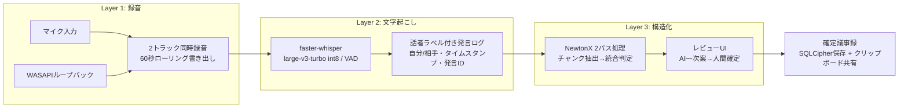

# 議事録自動生成アプリ 要件定義書

| 項目 | 内容 |
|---|---|
| バージョン | v0.9（PoC・ベンチマーク結果反映前） |
| 作成日 | 2026-08-15 |
| 対象読者 | 開発者本人 / Claude Code |
| ステータス | 要件確定（実測依存項目のみ未確定） |

---

## 1. 背景・目的

### 1.1 課題

- Teams/Zoom のレコーディング・トランスクリプト機能が使えない会議では、聞きながら（時にファシリテートしながら）手動で議事録を作成している。
- 現状の作業時間：会議内での記録 約15分 + 会議後の成形 約30分（計約45分/回、週5回）。
- 会話を記録しただけの議事録になり、「何が決まり」「何が決まらず残ったか」が判別できない。結果として見返されず、価値を生まない。

### 1.2 目的

会議音声を自動で取得・文字起こしし、NewtonX による構造化を経て、**決定事項と未決事項が一目でわかる議事録**を最小操作で生成・共有できるようにする。

### 1.3 成功指標

| 種別 | 指標 |
|---|---|
| KGI | 未決事項の放置がなくなり、プロジェクトが炎上しない |
| KPI-1 | 議事録作成の実作業時間：45分 → **10分以内** |
| KPI-2 | 共有までのリードタイム：**会議終了後30分以内** |
| KPI-3（理想） | 参加者全員が議事録を参照・理解し、能動的にタスクを遂行する |

---

## 2. 利用前提

| 項目 | 内容 |
|---|---|
| 利用者 | 本人のみ（シングルユーザー） |
| 会議 | 30〜60分 / 5人程度 / 週5回程度 |
| 会議種別 | 合意形成型（社内定例・顧客打合せ等）/ 業務報告型 |
| 言語 | 日本語のみ |
| 対応OS | Windows 10 / 11 |
| GPU | なし（CPUのみを前提に設計） |
| 会議中の操作 | **開始・終了の2操作のみ**（絶対制約） |
| デバイス | マイク・スピーカーは会議ごとに変わりうる |
| 録音同意 | 運用側で対応（アプリのスコープ外） |

---

## 3. システム構成

### 3.1 アーキテクチャ（3層 + キュー）



### 3.2 技術スタック

| 領域 | 技術 | 備考 |
|---|---|---|
| アプリ形態 | Python + pywebview | 音声処理と画面が同一プロセス |
| フロントエンド | React + TypeScript + Tailwind CSS + shadcn/ui | Zustand / ダーク・ライトモード対応 |
| 録音 | WASAPI ループバック（pyaudiowpatch 等） | マイク・ループバックの2トラック |
| 文字起こし | faster-whisper（ローカル） | large-v3-turbo int8 / CPU |
| 構造化AI | NewtonX（Python ADK） | デフォルト: Gemini 3.1 Pro |
| DB | SQLite + SQLCipher（AES-256） | FTS5 trigram 全文検索 |
| 認証情報 | Windows資格情報マネージャー（keyring） | NewtonX host / PAT（Personal Access Token）/ DB暗号鍵 |
| 配布（将来） | PyInstaller 単一実行ファイル | モデル同梱・差し替え可能 |

### 3.3 ジョブキューと状態遷移

各会議は以下の状態を持ち、キューで管理する。

```
録音中 → 録音済 → 文字起こし中 → 構造化待ち → 構造化中 → レビュー待ち → 確定
```

- 録音はキューと独立して**常に開始可能**（連続会議対応）。
- 文字起こしは**直列実行**（CPU競合回避）。録音中はCPU負荷を最小化する。
- NewtonX 利用不可（ネットワーク断・認証切れ・APIエラー）時は「構造化待ち」で停止し、一覧画面から手動再開できる。
- 構造化のみの再実行が可能（文字起こし結果は再利用）。

---

## 4. 機能要件

### F-1 録音機能

| ID | 要件 |
|---|---|
| F-1-1 | マイク入力と WASAPI ループバック出力を別トラックで同時録音する（16kHz / mono / 16bit WAV） |
| F-1-2 | 開始・終了ボタンのみで操作が完結する |
| F-1-3 | 60秒単位で連番ファイルに書き出し、終了時に結合する（クラッシュ耐性） |
| F-1-4 | 異常終了時、次回起動時に未結合ファイルを検出して復旧を提案する |
| F-1-5 | 起動時にデバイスを列挙し OS 既定を自動選択。画面から変更可能 |
| F-1-6 | 録音開始前に両トラックの入力レベルメーターを表示し、疎通確認できる |
| F-1-7 | 開始・終了時刻（yyyymmdd hhmmss）を自動記録し、会議時間を算出する |
| F-1-8 | 前の会議の議事録生成中でも、次の会議の録音を開始できる |

### F-2 文字起こし機能

| ID | 要件 |
|---|---|
| F-2-1 | faster-whisper（large-v3-turbo int8）でローカル文字起こしする。モデルは設定画面から turbo / medium / small に切替可能 |
| F-2-2 | VAD により無音区間をスキップする |
| F-2-3 | 音声をチャンク分割し、CPUコア数に応じて並列処理する |
| F-2-4 | 2トラックをタイムスタンプで時系列マージし、「自分 / 相手」の話者ラベルを付与する |
| F-2-5 | 各発言に連番ID・タイムスタンプを付与した発言ログを生成・保存する |
| F-2-6 | 固有名詞辞書（キー・値のフラットな辞書）を initial_prompt として適用する。辞書は設定画面から登録・編集する |
| F-2-7 | 発言ログはユーザーが画面上で修正でき、修正後は構造化のみを再実行できる |

### F-3 構造化機能（NewtonX）

| ID | 要件 |
|---|---|
| F-3-1 | 発言ログを約10分単位のチャンクに分割し、チャンク単位で一次抽出 → 全体統合の2パス処理を行う |
| F-3-2 | モデルはパス別（extraction / consolidation）に設定可能。デフォルトは両方 Gemini 3.1 Pro（`4739b074-6634-471d-b356-e6ad3d26e8bd`） |
| F-3-3 | `web_search=False` を明示指定する |
| F-3-4 | JSON出力モード非対応への対策として、区切りマーカー形式の出力指定 + パーサ + リトライの多層防御を行う |
| F-3-5 | `parent_order` でチャンク間の文脈を維持する |
| F-3-6 | 各項目に根拠発言ID・確信度を含めて出力させる（内部データとして保持し、議事録本体には出力しない） |
| F-3-7 | 会議種別（合意形成型 / 業務報告型）はユーザーが終了後に明示指定する。AI自動判定は行わない |
| F-3-8 | 発言ログ修正後の再実行では、修正発言を含むチャンクのみを再送し（解釈A）、前回と差分が出た項目のみ確認済みチェックをリセットしてハイライトする（解釈B） |
| F-3-9 | 合意判定ルール・出力形式・粒度基準はシステムプロンプトとしてアプリに内蔵し、ユーザーは編集できない |

#### F-3 合意判定ルール（システムプロンプトに内蔵）

| 発言パターン | 判定 |
|---|---|
| 「それで進めましょう」「承知しました」等の明示的承認 | 決定（確定） |
| 「基本的にその方向で問題ない」等の肯定的応答 | 決定(確定)。**明確な反対・保留がない限り、肯定的応答は合意とみなす** |
| 「一旦それで進めて、また相談」「暫定的に」「まずはこれで」 | 決定（**中間決定**・要追加検討フラグ付与） |
| 反対意見が未解消 / 情報不足 / 持ち帰り / 次回持ち越し | 未決 |
| 「誰が何をやる」という発言 | ToDo として抽出 |

- 粒度基準：1つの論点に対する結論を1件とする（30〜60分会議で決定事項1〜3件が目安。件数の上限指定はしない）。
- 決定が会議中に覆った場合、最終結論に加えて経緯を記録する（変遷があった項目のみ）。
- 該当項目が0件のセクションは「該当なし」と明記する。

### F-4 議事録データモデル

#### 共通

| セクション | 出力条件 |
|---|---|
| サマリ（3行程度） | 常に必須（両種別共通） |
| 決定事項 | 合意形成型で必須。報告型でも検出時は出力 |
| 未決事項 | 同上 |
| ToDo | 「誰が何をやる」発言の検出時のみ（両種別） |
| 報告事項 | 業務報告型のみ |
| 追加セクション | ユーザー指示があった場合のみ |

#### 項目定義

| セクション | フィールド |
|---|---|
| 決定事項 | タイトル / 内容（決定した結果）/ 根拠発言（複数発言を要約）/ 確定度（確定・中間決定）/ 経緯（変遷時のみ）|
| 未決事項 | タイトル / 内容（何が未決か）/ 未決理由（意見対立・情報不足・持ち帰り等）/ 検討事項 |
| ToDo | タイトル / 内容（何をやるか）/ 担当者 / 期限（未明示は「期限未定」）|
| 報告事項 | タイトル / 内容 / 分類（進捗報告・連絡・相談）/ 状況（未着手・実施中・完了・保留・その他）/ 回答内容 / 備考 |

- 担当者の内部構造：`{ 氏名: string | null, 帰属: "自分" | "相手", 特定済み: boolean }`。表示は「田中様」「相手（氏名未特定）」等。
- 報告事項の状況：分類が進捗報告以外の場合は「その他」固定。進捗報告の場合は会話内容から選択。
- 内部保持のみ（議事録に非出力）：確信度 / 根拠発言ID。

### F-5 レビューUI（生成完了画面）

| ID | 要件 |
|---|---|
| F-5-1 | 全項目を確信度の昇順で列挙する（低確信度が上位） |
| F-5-2 | 項目はアコーディオン表示。設定した閾値未満の項目はデフォルト展開、以上は閉じた状態。手動開閉可能 |
| F-5-3 | 確信度の閾値は設定画面から変更できる |
| F-5-4 | テキスト直接編集・項目の削除・追加・セクション間移動が可能 |
| F-5-5 | 項目クリックで根拠発言の該当箇所（前後数発言）を表示。オプションで発言ログ全文表示に切替可能 |
| F-5-6 | 会議種別の切替と追加セクション指示の変更後、構造化のみを再実行できる |
| F-5-7 | 「確定」操作で議事録をロック（以降編集不可）し、ローカル保存・一覧画面反映・クリップボードへの自動コピーを行う |

### F-6 会議終了後フロー

```
[終了ボタン]
   ├─ 裏：文字起こしを即時開始
   └─ 表：入力画面を即座に表示
        ・会議名（1行自由記述）
        ・会議分類（合意形成型 / 業務報告型）
        ・追加セクション指示（任意・テンプレート選択可）
[実行ボタン] → 文字起こし完了を待って構造化 → レビュー → 確定
```

- 処理はバックグラウンドで実行し、画面に進捗率を表示する。
- 追加セクションテンプレートは「テンプレート名 + 指示文」で登録・編集できる。
- 出力オプション（決定事項・未決事項・ToDo等の含有スイッチ）を設定でき、組み合わせに応じてアプリが内蔵プロンプトを組み立てる。

### F-7 一覧・閲覧・共有

| ID | 要件 |
|---|---|
| F-7-1 | 一覧列：会議日 / 開始時刻 / 終了時刻 / 会議時間 / 会議名 / 分類 / 決定数 / 未決数 / ToDo数 / 確定状態 |
| F-7-2 | デフォルトソートは開始時刻の降順。列ごとのフィルター・ソートが可能 |
| F-7-3 | 全文検索：会議名 + 議事録本文（全セクション）+ コメント。FTS5 + trigram トークナイザ。発言ログは対象外（拡張可能な設計とする） |
| F-7-4 | 議事録の削除はユーザー操作による論理削除のみ。自動削除しない（永久保存） |
| F-7-5 | コメント機能：議事録全体および項目単位に紐付け可能。確定後も追加できる |
| F-7-6 | コピー機能：CF_HTML + プレーンテキストをクリップボードに同時格納（Teams貼り付けでリッチ表示、テキストエディタでプレーン表示） |
| F-7-7 | HTMLは見出し・太字・表・箇条書きのみのシンプル構成（Teamsのレンダリング特性に対応） |
| F-7-8 | 部分コピー：項目・セクションを任意選択してコピー可能。コメントの含有可否を選択できる |

### F-8 設定機能（すべてGUIから操作。ファイル直接編集は不要）

| ID | 設定項目 |
|---|---|
| F-8-1 | NewtonX 認証：会社サブドメイン + Personal Access Token（PAT）入力 → 保存 → 認証状態表示（PAT方式。NewtonX Web版でPATを発行し貼り付ける。ブラウザ起動は不要）。資格情報は keyring 保存（`docs/DESIGN.md` §5.6 参照） |
| F-8-2 | NewtonX モデル選択：extraction / consolidation の2スロット。アシスタント一覧は `get_assistants()` から取得して表示 |
| F-8-3 | Whisperモデル選択（turbo / medium / small） |
| F-8-4 | 録音デバイス選択（自動検出 + 手動変更） |
| F-8-5 | 固有名詞辞書の登録・編集・削除 |
| F-8-6 | 確信度閾値 |
| F-8-7 | 追加セクションテンプレートの管理 |
| F-8-8 | 出力オプション（セクション含有スイッチ） |
| F-8-9 | ダーク / ライトモード切替 |

### F-9 音声データ管理

| ID | 要件 |
|---|---|
| F-9-1 | 文字起こし完了後、WAV を圧縮形式（MP3等）に変換して保持する |
| F-9-2 | 音声は1ヶ月保持し、超過分は自動で物理削除する |
| F-9-3 | 発言ログは議事録と同一ライフサイクルで保持する（音声削除後も根拠参照を維持） |

---

## 5. 非機能要件

| 分類 | 要件 |
|---|---|
| 性能 | 60分会議の文字起こしを実測し、20分超過時は medium への切替を検討（Phase 1 でベンチマーク確定） |
| セキュリティ | DB は SQLCipher（AES-256）で暗号化。音声ファイル（WAV・圧縮後とも）も同方針で暗号化。鍵は keyring 管理・初回起動時自動生成 |
| セキュリティ | 鍵は端末の資格情報ストアに紐づくため、DBファイル単体を他端末へ移しても復号不可（盗難対策としての仕様） |
| 可用性 | クラッシュ時も直近60秒までの録音を保全。NewtonX 障害時は構造化待ちで保留し再開可能 |
| 保守性 | Zero Hardcoding：全文言は locales / constants に外出し。全パラメータは設定ストアで管理し GUI から変更可能 |
| 保守性 | DRY：共有ロジックは単一実装箇所に集約 |
| 配布（将来） | PyInstaller 単一実行ファイル。モデルパス・データ保存先は実行ファイル基準の相対パスで解決（設計段階から遵守） |

---

## 6. スコープ外

- 議事録のファイル出力（Markdown / docx）→ 運用後の要望次第で追加開発
- 相手側の個人単位の話者識別（話者A/B）→ 将来検討
- 多言語対応（UI・議事録とも日本語のみ）
- クラウド同期・複数端末間のデータ共有・バックアップ
- 議事録の他者との共同編集
- Teams/Zoom API との直接連携（予定表からの会議情報自動取得等）→ **将来の追加開発として優先度高**
- 録音同意の取得プロセス（運用側で対応）

---

## 7. 開発フェーズ

| Phase | 内容 | 到達点 |
|---|---|---|
| 0 | ループバック録音 PoC | 実際の会議アプリ起動状態で相手音声が取得できることの実証（**最重要・最優先**） |
| 1 | 2トラック録音 + STT + ベンチマーク | 話者ラベル付き発言ログの出力。60分会議の処理時間実測とモデル確定 |
| 2 | NewtonX 構造化 | 2パス処理・合意判定・3分類議事録の生成 |
| 3 | レビューUI + 確定フロー + クリップボード共有 | 「AI一次案 → 人間確定」ループの完成。Teams 貼り付け検証 |
| 4 | 一覧・検索・コメント + 暗号化 + キュー完成 | 全機能結合 |
| 5 | パッケージ化（PyInstaller） | 配布可能な単一実行ファイル |

---

## 8. 未確定事項（v1.0 までに解消）

| # | 項目 | 確認方法 |
|---|---|---|
| 1 | 会社PCでのループバック録音可否（排他モード・エコーキャンセルの影響） | Phase 0 PoC。開発機での技術的な疎通（ストリームopen/close成功）は確認済み。実際の会議アプリ起動中の相手音声取得は未検証（`poc_verify.py`での手動確認待ち） |
| 2 | 60分会議の文字起こし実測時間（CPU環境） | Phase 1 ベンチマーク。`bench_transcribe.py` 実装済み・小規模録音での動作は実機確認済みだが、60分規模の実測は未実施（実会議データ待ち） |
| 3 | 会社PCで pip / Hugging Face へのアクセス可否 | 環境確認（不可時はモデルのオフライン持ち込み運用）。開発機からのHugging Face到達性・faster-whisperモデル(tiny)の実ダウンロード＆推論成功を確認済み（2026-08-16。ただし本セッション環境＝実際の会社PC/社内ネットワーク制限下と同一かはユーザー側で要最終確認） |
| 4 | NewtonX のレート制限・最大入力トークン数 | 実測または管理者への確認（ADK公式ドキュメント・ソースコードいずれにも記載なし。`docs/DESIGN.md` §10 参照） |
| 7 | `send_message()` の `parent_order` 非対応（インストール済み v0.10.5）が新バージョンで解消されるか | NewtonXヘルプデスク（`newtonx_helpdesk@seraku.co.jp`）へ確認。`docs/DESIGN.md` §5.3 参照 |
| 5 | Teams への CF_HTML 貼り付け時のレンダリング再現度 | Phase 3 実機検証 |
| 6 | PyInstaller 配布物の社内配布可否 | 社内ルール確認（Phase 5 前まで） |

---

## 9. 改訂履歴

| 版 | 日付 | 内容 |
|---|---|---|
| v0.9 | 2026-08-15 | 要件定義インタビュー（全8ラウンド）の結果を集約し初版作成 |
| v0.10 | 2026-08-15 | `newtonx_adk` ソースコード検証結果を反映。F-8-1をPAT認証方式に修正。§8未確定事項に`parent_order`非対応の件を追加 |
| v0.11 | 2026-08-17 | Phase 0/Phase 1の実装・実機確認結果を反映し§8未確定事項#1〜#3の状況を更新（#1: 技術的疎通は確認済み・会議アプリ実行下の検証は未実施。#2: ベンチマーク実装済み・60分規模の実測は未実施。#3: 開発機からのHugging Face到達性・モデルダウンロード＆推論成功を確認） |
